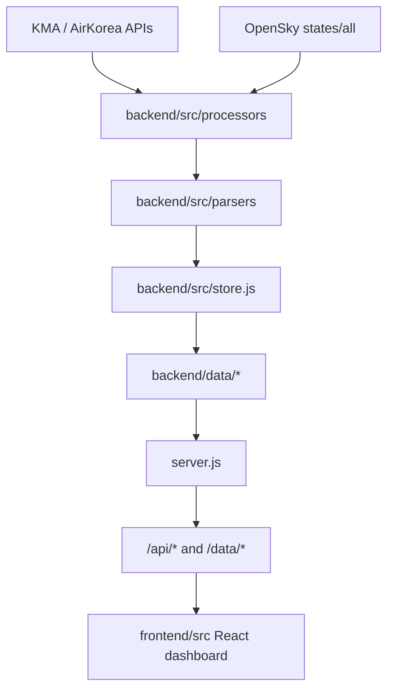

# Architecture

Status: Current as of 2026-05-02.

이 문서는 현재 코드 기준의 전체 구조를 설명합니다. 과거 설계 배경은 정리 후 `docs/archive/`에 보관하고, 현재 동작은 이 문서를 우선합니다.

## 사이트에서 하는 일

이 프로젝트는 KMA 항공기상, 레이더, 위성, 낙뢰, 지상예보, 환경정보, OpenSky ADS-B 항적 데이터를 수집해서 `/ops`, `/ground`, `/test` 화면에 보여주는 대시보드다. 백엔드는 주기적으로 외부 API를 호출해 JSON/이미지 파일을 만들고, `server.js`는 그 데이터를 `/api/*`와 `/data/*`로 제공한다.

프론트엔드는 이 데이터를 조합해서 공항별 METAR/TAF, 공항경보, 지도 오버레이, 낙뢰/항적, 지상근무자용 예보 화면을 렌더링한다. 전체 구조를 이해할 때는 “수집기 -> 저장소 -> API/정적 파일 -> React 화면” 흐름으로 보면 된다.

## Runtime Overview

## Entry Points

- `server.js`: local dashboard server. It serves API responses, `/data/*`, static frontend assets, and SPA entries.
- `backend/src/index.js`: scheduler entry point. It runs collectors on cron schedules and performs one initial collection pass at startup.
- `frontend/src/App.jsx`: main React shell for `/ops`, `/ground`, and `/test`.

`npm run dashboard` starts `server.js`. `npm run start` runs only the scheduler. `npm run dev` runs both `server.js` and Vite.

## Server Surface

`server.js` redirects `/` to `/ops` and treats `/ops`, `/ground`, and `/test` as SPA entry paths.

Current JSON/API endpoints:

| Endpoint | Source |
|---|---|
| `/api/metar` | `backend/data/metar/latest.json` plus test merge behavior |
| `/api/taf` | `backend/data/taf/latest.json` plus test merge behavior |
| `/api/warning` | `backend/data/warning/latest.json` plus test merge behavior |
| `/api/sigmet` | `backend/data/sigmet/latest.json` |
| `/api/airmet` | `backend/data/airmet/latest.json` |
| `/api/sigwx-low` | `backend/data/sigwx_low/latest.json` |
| `/api/sigwx-low-history` | recent `sigwx_low` snapshots |
| `/api/sigwx-low-fronts?tmfc=...` | `fronts_meta_<tmfc>.json` |
| `/api/sigwx-low-clouds?tmfc=...` | `clouds_meta_<tmfc>.json` |
| `/api/amos` | `backend/data/amos/latest.json` plus test merge behavior |
| `/api/lightning` | processed lightning latest payload |
| `/api/adsb` | `backend/data/adsb/latest.json` |
| `/api/ground-forecast` | `backend/data/ground_forecast/latest.json` |
| `/api/ground-overview` | `backend/data/ground_overview/latest.json` |
| `/api/environment` | `backend/data/environment/latest.json` |
| `/api/airports` | `shared/airports` reloaded from CommonJS |
| `/api/warning-types` | shared warning type definitions |
| `/api/alert-defaults` | shared alert defaults |
| `/api/snapshot-meta` | content hashes and frame timestamps for incremental polling |

Static data is served from `backend/data/` through `/data/*`. Versioned `.geojson` and `.topojson` assets are cacheable for one year; airport weather assets are cacheable for one day; other static responses are no-cache.

## Scheduler

The scheduler is defined in `backend/src/index.js`.

- `runWithLock(type, job)` prevents overlapping jobs of the same type.
- Each job result is recorded through `backend/src/stats.js`.
- On startup, the scheduler initializes directories, loads previous `latest.json` files into cache, restores stats, registers cron schedules, then runs one immediate collection pass.

Current schedules from `backend/src/config.js`:

| Type | Cron |
|---|---|
| METAR | `*/10 * * * *` |
| TAF | `*/30 * * * *` |
| WARNING | `*/5 * * * *` |
| SIGMET | `*/5 * * * *` |
| AIRMET | `*/5 * * * *` |
| SIGWX_LOW | `5 5,11,17,23 * * *` |
| AMOS | `*/10 * * * *` |
| LIGHTNING | `*/5 * * * *` |
| RADAR_ECHO | `*/5 * * * *` |
| SATELLITE | `*/10 * * * *` |
| ADSB | `*/5 * * * *` |
| GROUND_FORECAST | `30 6,11,18,23 * * *` |
| ENVIRONMENT | `10 * * * *` |

## Storage And Cache

`backend/src/store.js` owns file persistence and in-memory cache state.

- Supported persisted types include `metar`, `taf`, `warning`, `lightning`, `sigmet`, `airmet`, `sigwx_low`, `amos`, `adsb`, `ground_forecast`, `ground_overview`, and `environment`.
- Each type gets a `backend/data/<type>/latest.json`.
- Changed payloads also get a timestamped historical JSON file.
- Payload hashes are canonicalized with volatile fields such as `fetched_at`, `type`, `_stale`, and `content_hash` excluded.
- If a payload is unchanged, `latest.json` still gets a fresh `fetched_at` and `content_hash`.
- `sigwx_low` snapshots are named by `tmfc` when possible, and stale front/cloud overlay files are cleaned up when old snapshots disappear.

Generated runtime data under `backend/data/` should not be committed unless explicitly requested.

## Frontend Data Flow

`frontend/src/utils/api.js` performs initial loading and incremental refreshes.

- `loadAllData()` fetches the full initial dataset.
- `fetchSnapshotMeta()` reads `/api/snapshot-meta` in live mode.
- `/test` mode prefers `frontend/public/test/*` snapshots before falling back to live endpoints.
- `loadChangedData(changes)` fetches only datasets whose hash or frame timestamp changed.
- SIGWX_LOW front/cloud overlay metadata can also be fetched by selected `tmfc`.

The main app shell keeps route-specific state in `frontend/src/App.jsx`.

- `/ops`: aviation operations dashboard.
- `/ground`: ground/general staff dashboard.
- `/test`: snapshot-driven test mode.
- Mobile `/ops` activates at `window.innerWidth <= 768` and uses dedicated tabs and localStorage keys.

## Related Documents

- `docs/backend-collectors.md`: current-state collector details.
- `docs/frontend-dashboard.md`: planned current-state UI behavior.
- `docs/map-overlays.md`: planned current-state map overlay behavior.
- `docs/weather-parsing.md`: planned parser summary.
- `docs/operations.md`: planned deployment and operational notes.
